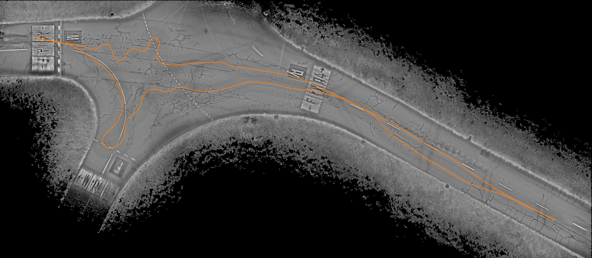
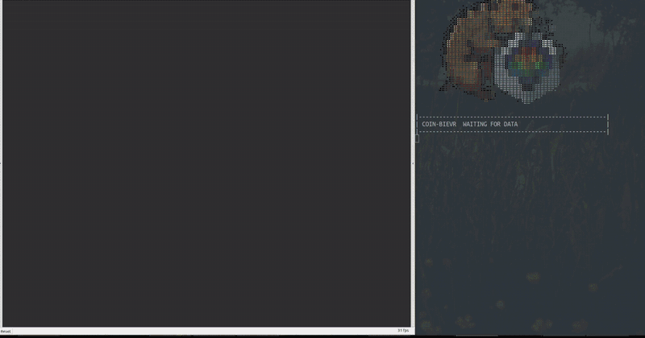

# COIN-BIEVR: 3D Intensity Mapping for Robust LiDAR-Inertial Odometry

<p align="center">
  
</p>
<p align="center">
  <em>Voxel-wise intensity map built by COIN-BIEVR on the ENWIDE <code>IntersectionS</code> sequence
  (top-down view, estimated trajectory in orange).</em>
</p>

This repository is an **unofficial implementation** of

> P. Pfreundschuh, C. Le Gentil, R. Siegwart, C. Cadena,
> *COIN-BIEVR: 3D Intensity Mapping for Robust LiDAR-Inertial Odometry*.

It is built on top of the official [BIEVR-LIO](https://github.com/ethz-asl/BIEVR-LIO) code and
reuses the intensity image filter of [COIN-LIO](https://github.com/ethz-asl/COIN-LIO). It is not
affiliated with or endorsed by the authors of the paper; all credit for the method goes to them.

COIN-BIEVR augments the voxel-wise oriented height images of BIEVR-LIO with **voxel-wise intensity
maps**. LiDAR intensity then constrains the registration in directions in which the geometry is
uninformative (tunnels, flat fields, runways), without relying on dense projected intensity images,
so it also works for sensors with irregular scan patterns.

| Paper | Implementation |
|-------|----------------|
| II-A Intensity processing (projection, brightness normalization, Ouster lookup and line removal) | [`BIEVR/src/intensity.cpp`](BIEVR/src/intensity.cpp) |
| II-B Voxel-wise intensity map | [`BIEVR/src/bievr_map.cpp`](BIEVR/src/bievr_map.cpp) |
| II-C Map-informed intensity point sampling | `sampleIntensity` in [`BIEVR/src/preprocess.cpp`](BIEVR/src/preprocess.cpp) |
| II-D Registration with geometric and photometric residuals | [`BIEVR/src/ls_optimizer.cpp`](BIEVR/src/ls_optimizer.cpp) |

The geometric pipeline is untouched: with `intensity.enabled: False` the estimator is BIEVR-LIO and
produces bit-identical trajectories.

<p align="center">
  
</p>
<p align="center">
  <em>COIN-BIEVR running on the GEODE <code>Shield_tunnel1_gamma</code> sequence (Livox Avia).
  Left: voxel-wise intensity map in RViz; right: online state estimate and timing.</em>
</p>

# Results

Absolute Trajectory Error (RMSE in meters) on the sequences of Table I of the paper that were
available for this reproduction. The *paper* columns are copied from the paper, the other columns
were produced with this repository and its default configuration (see
[Reproducing the results](#reproducing-the-results)). BIEVR-LIO is this code with
`intensity.enabled: False`. The better of the two methods run here is set in bold.

| Dataset | Sequence | BIEVR-LIO (paper) | BIEVR-LIO (this code) | COIN-BIEVR (paper) | COIN-BIEVR (this code) |
|---------|----------|------------------:|----------------------:|-------------------:|-----------------------:|
| ENWIDE (Ouster OS0-128) | IntersectionS | 0.231 | 0.231 | 0.166 | **0.164** |
| ENWIDE (Ouster OS0-128) | IntersectionD | 0.404 | 0.404 | 0.303 | **0.345** |
| ENWIDE (Ouster OS0-128) | RunwayS | 0.440 | 0.373 | 0.312 | **0.287** |
| ENWIDE (Ouster OS0-128) | RunwayD | 4.350 | 4.282 | 2.245 | **0.292** |
| ENWIDE (Ouster OS0-128) | FieldS | 0.159 | 0.161 | 0.153 | **0.153** |
| ENWIDE (Ouster OS0-128) | FieldD | 0.174 | 0.177 | 0.175 | **0.171** |
| ENWIDE (Ouster OS0-128) | KatzenseeS | 0.194 | 0.197 | 0.186 | **0.186** |
| ENWIDE (Ouster OS0-128) | KatzenseeD | 0.243 | 0.242 | 0.220 | **0.216** |
| GEODE (Livox Avia) | Shield1 | 0.256 | 0.251 | 0.220 | **0.214** |
| GEODE (Livox Avia) | Shield4 | 0.275 | 0.490 | 0.245 | **0.173** |
| GEODE (Livox Avia) | Shield5 | 0.146 | **0.142** | 0.219 | 0.213 |

- **Baseline.** The BIEVR-LIO numbers of the paper are reproduced with the unmodified BIEVR-LIO
  code, which validates the evaluation protocol. The exception is `Shield4`, whose total station
  ground truth jitters in time, so its absolute numbers depend on how the trajectories are
  associated.
- **COIN-BIEVR.** The errors are within a few centimeters of the paper on most sequences and show
  the same pattern: large gains where the geometry is degenerate (Intersection, Runway, the
  along-tunnel drift in `Shield4`), small gains in well constrained scenes, and a higher error on
  `Shield5`, which the paper attributes to near-range intensity artifacts.
- **`RunwayD`** is tracked without the partial failure the paper reports (2.2 m). This sequence
  is sensitive to the photometric scale, see below.
- **Not evaluated**, as the data was not available here: Newer College, the ENWIDE Tunnel
  sequences, GEODE `FlatSurfacesS` and the GrandTour Livox Mid-360 experiment.

## Sensitivity to the photometric scale

The paper does not state the value of the constant λ that balances photometric and geometric
residuals. ATE RMSE [m] for different values (`x`: diverged):

| Sequence | BIEVR-LIO | λ = 0.0005 | λ = 0.001 | λ = 0.0015 | λ = **0.002** | λ = 0.003 | λ = 0.004 |
|----------|----------:|------:|------:|------:|------:|------:|------:|
| IntersectionS | 0.231 | 0.203 | 0.166 | 0.155 | 0.164 | 0.188 | 0.204 |
| IntersectionD | 0.404 | 0.338 | 0.277 | 0.290 | 0.345 | 0.368 | 0.982 |
| RunwayS | 0.373 | 0.196 | 0.255 | 0.269 | 0.287 | 0.293 | 0.294 |
| RunwayD | 4.282 | 10.2 | 7.20 | 0.283 | 0.292 | 0.286 | 0.305 |
| FieldS | 0.161 | 0.161 | 0.157 | 0.155 | 0.153 | 0.143 | 0.145 |
| FieldD | 0.177 | 0.173 | 0.169 | 0.177 | 0.171 | 0.176 | 0.196 |
| KatzenseeS | 0.197 | 0.195 | 0.190 | 0.187 | 0.186 | 0.185 | 0.191 |
| KatzenseeD | 0.242 | 0.238 | 0.227 | 0.219 | 0.216 | 0.228 | 0.234 |
| Shield1 | 0.251 | 0.206 | 0.206 | 0.205 | 0.214 | 0.215 | 0.218 |
| Shield4 | 0.490 | 0.177 | 0.173 | 0.173 | 0.173 | 0.174 | 0.174 |
| Shield5 | 0.142 | x | 0.194 | 0.211 | 0.213 | 0.211 | 0.214 |

Values between 0.0015 and 0.003 work on all sequences; the default is 0.002. Note that it was
chosen on the same sequences that are reported above. With λ = 0.001 (about the value used by
COIN-LIO) most numbers are closest to the paper, including a failure on `RunwayD`. With a weak photometric term the fully degenerate segments of `RunwayD` and the
turnaround in `Shield5` are lost, while a strong one degrades the accuracy where the geometry is
informative (`IntersectionD`).

## GrandTour with a Velodyne VLP-16

The paper evaluates GrandTour with the Livox Mid-360. The GrandTour sequences available here
only contain the ANYmal sensors (16-beam Velodyne VLP-16 and ANYmal IMU), so these numbers are an
additional test on a sparse spinning LiDAR and cannot be compared to the paper. As in the paper,
the LiDAR range is additionally capped at 5 m to induce degeneracy. ATE RMSE [m] against the
CPT7 reference (`x`: diverged):

| Sequence | BIEVR-LIO | COIN-BIEVR | BIEVR-LIO (< 5 m) | COIN-BIEVR (< 5 m) |
|----------|----------:|-----------:|------------------:|-------------------:|
| ARC2 | 0.396 | 0.384 | 1.718 | 2.074 |
| ARC3 | x | 3.586 | x | x |
| HEAP1 | 0.037 | 0.035 | 0.528 | 7.401 |
| PIL2 | 0.131 | 0.131 | 1.404 | 8.080 |
| SBB1 | 0.056 | 0.052 | 1.644 | 0.833 |
| ICE1 | 3.478 | 3.476 | 3.479 | 3.483 |

- At full range COIN-BIEVR is on par with or slightly better than BIEVR-LIO.
- In `ARC3` the Velodyne stream drops to one scan every 1.7 s for about 11 s while the robot is in
  a confined space. BIEVR-LIO diverges there; COIN-BIEVR completes the sequence, but with a large
  error, and the outcome changes with the intensity settings, so this is not a robust gain.
- With the range capped at 5 m the 16 beams leave only a few sparse rings on the ground. The
  intensity maps are then too sparse to be reliable and the photometric term does not help
  consistently (better in `SBB1`, worse in `HEAP1` and `PIL2`).
- `ICE1`: both methods agree with each other to millimeters but differ from the reference by
  3.5 m, so the reference is presumably not valid for this sequence.

## Runtime

Mean processing time per scan and peak memory of `process_bag` on an AMD Ryzen 7 7700 (8 cores,
16 threads):

| Data | BIEVR-LIO | COIN-BIEVR |
|------|-----------|------------|
| ENWIDE (Ouster OS0-128, 131k points per scan) | 6.0 - 6.3 ms, 237 - 260 MB | 8.3 - 8.9 ms, 384 - 409 MB |
| GEODE `Shield1` (Livox Avia, 24k points per scan) | 4.9 ms, 277 MB | 6.8 ms, 444 MB |
| GrandTour `ARC2` (Velodyne VLP-16, 17k points per scan) | 3.0 ms, 420 MB | 3.6 ms, 620 MB |

On the Ouster data the intensity extension adds about 2.5 ms per scan: 1.2 ms for the intensity
processing and the rest for the intensity point sampling, the photometric residuals and the update
of the intensity maps. The peak memory grows by roughly 50 - 60 %.

# Setup

The code keeps the structure and package names of BIEVR-LIO. The core estimator (`bievr_lio`) is a
self-contained, ROS-independent library. On top of it there is a **ROS1** interface
(`bievr_lio_ros`) and a **ROS2** interface (`bievr_lio_ros2`), which live side by side under
`interfaces/`. Everything below was developed and tested with the ROS1 interface on Ubuntu 20.04
(ROS Noetic); the ROS2 interface shares the core library and the config loader.

## Installation

### Dependencies

The core estimator only needs **[Eigen](https://eigen.tuxfamily.org)**,
**[Ceres](http://ceres-solver.org)** and TBB; the intensity extension adds no dependency.


Build instructions for both ROS versions are below. The Docker files in `docker/` are the
unmodified ones of BIEVR-LIO: they clone and build the upstream BIEVR-LIO repository, so the clone
URL in `docker/scripts/build_ros1.sh` / `build_ros2.sh` has to be changed to this repository
before they can be used for COIN-BIEVR.

<details>
<summary><b>ROS1</b></summary>
<br>

### Build

Requires [ROS Noetic](https://wiki.ros.org/noetic/Installation/Ubuntu) and
`python3-catkin-tools` (`sudo apt install python3-catkin-tools`).

Create a catkin workspace and clone this repository into it:

```bash
mkdir -p ~/catkin_ws/src
cd ~/catkin_ws
catkin init
catkin config --extend /opt/ros/noetic
catkin config --cmake-args -DCMAKE_BUILD_TYPE=Release
catkin config --merge-devel

cd ~/catkin_ws/src
git clone <url of this repository> COIN-BIEVR
```

Install the Ceres version used by BIEVR-LIO with the provided script (builds
Ceres 2.2.0 from source):

```bash
./COIN-BIEVR/docker/scripts/install_ceres.sh
```

If Ceres is installed outside of the system paths, point CMake to it with
`catkin config --cmake-args -DCMAKE_BUILD_TYPE=Release -DCeres_DIR=<prefix>/lib/cmake/Ceres`. Its
library folder is stored in the RUNPATH of `libbievr_lio.so`, so no `LD_LIBRARY_PATH` is needed at
runtime.

(Optional) **Livox support.** The Livox `CustomMsg` branches are only compiled if
the corresponding driver is found in the workspace at build time. Otherwise
the code builds fine without them. If you need to process Livox data (e.g. GEODE), clone and
build the matching driver into `~/catkin_ws/src` *before* building, or extend a workspace that
contains it (`catkin config --extend <livox workspace>/devel`). Each driver also needs its
Livox-SDK installed system-wide:

- Livox gen1 (`livox_ros_driver`, enables `BIEVR_WITH_LIVOX`):
  [livox_ros_driver](https://github.com/Livox-SDK/livox_ros_driver) +
  [Livox-SDK](https://github.com/Livox-SDK/Livox-SDK)
- Livox gen2 (`livox_ros_driver2`, enables `BIEVR_WITH_LIVOX2`):
  [livox_ros_driver2](https://github.com/Livox-SDK/livox_ros_driver2) +
  [Livox-SDK2](https://github.com/Livox-SDK/Livox-SDK2)

Build and source it:

```bash
cd ~/catkin_ws
catkin build bievr_lio_ros
source devel/setup.bash
```
</details>

<details>
<summary><b>ROS2</b></summary>
<br>

### Build

Requires [ROS2 Jazzy](https://docs.ros.org/en/jazzy/Installation.html) and
`python3-colcon-common-extensions`
(`sudo apt install python3-colcon-common-extensions`). The system was tested on
Jazzy, but other ROS2 distributions might also work.

Create a colcon workspace and clone this repository into it:

```bash
mkdir -p ~/colcon_ws/src
cd ~/colcon_ws/src
git clone <url of this repository> COIN-BIEVR
```

Install the Ceres version used by BIEVR-LIO with the provided script (builds
Ceres 2.2.0 from source):

```bash
./COIN-BIEVR/docker/scripts/install_ceres.sh
```

(Optional) **Livox support.** The Livox `CustomMsg` branch is only compiled if
`livox_ros_driver2` is found in the workspace at build time. Otherwise the code
builds fine without it. If you need to process Livox data, clone and build the
driver into `~/colcon_ws/src` *before* building (it also needs its
Livox-SDK2 installed system-wide). Only gen2 exists for ROS2 (enables
`BIEVR_WITH_LIVOX`):

- [livox_ros_driver2](https://github.com/Livox-SDK/livox_ros_driver2) +
  [Livox-SDK2](https://github.com/Livox-SDK/Livox-SDK2)

Build and source it (from the workspace root, so colcon picks up both `BIEVR/`,
the core, and `interfaces/ros2`):

```bash
cd ~/colcon_ws
source /opt/ros/jazzy/setup.bash
colcon build --packages-up-to bievr_lio_ros2
source install/setup.bash
```
</details>

## Run data

There are two entry points, available for both ROS versions:

- **`process_topics`** runs online: it subscribes to the LiDAR and IMU topics and
  processes messages as they arrive. Use it with a live sensor or alongside
  `rosbag play`.
- **`process_bag`** reads a recorded bag directly and pushes its messages through
  the pipeline as fast as they can be processed (no real-time playback). This is the preferred choice for offline evaluation and reproducing results.

In the commands below, replace `<sensor_config>` with one of the provided configs
(see [Configuration](#configuration)) or your own. Add `rviz:=true` to bring up
the visualization.

<details>
<summary><b>ROS1</b></summary>
<br>

Process live topics:

```bash
roslaunch bievr_lio_ros process_topics.launch sensor_config:=<sensor_config>
```

Replay a rosbag:

```bash
roslaunch bievr_lio_ros process_bag.launch sensor_config:=<sensor_config> rosbag:=/path/to/bag.bag
```
</details>

<details>
<summary><b>ROS2</b></summary>
<br>

Process live topics:

```bash
ros2 launch bievr_lio_ros2 process_topics.launch.py sensor_config:=<sensor_config>
```

Replay a rosbag2 directory:

```bash
ros2 launch bievr_lio_ros2 process_bag.launch.py sensor_config:=<sensor_config> rosbag:=/path/to/bag_dir
```
</details>

## Configuration

The configuration is split in two files:

- **`config/params.yaml`**: Algorithm parameters (map resolution, sampling,
  optimization, intensity, IMU window, ...). These are dataset-independent and are
  identical for all experiments.
- **`config/sensor_configs/<name>.yaml`**: Per-dataset / per-sensor settings:
  the LiDAR and IMU topic names, the LiDAR→IMU extrinsic calibration, the
  LiDAR min/max range and the intensity preprocessing of the sensor.

Select a sensor config at launch with `sensor_config:=<name>`, which resolves to
`config/sensor_configs/<name>.yaml` (an absolute path starting with `/` is used
verbatim, so configs may also live outside the package). Likewise `params:=<name>`
(default `params`) selects `config/<name>.yaml`.

### Intensity

The `intensity` section configures the intensity extension. The algorithm parameters are set in
`params.yaml`:

| Parameter | Default | Description |
|-----------|---------|-------------|
| `enabled` | `True` | Use the LiDAR intensity. `False` gives the purely geometric BIEVR-LIO. |
| `num_voxels` | `100` | Number of voxels with the strongest contribution that intensity points are sampled from. |
| `photo_scale` | `0.002` | Constant λ that scales the photometric residuals (intensities in [0, 255]) to the geometric residuals [m]. |
| `smooth` | `True` | Smooth the voxel intensity maps like the height images. |
| `degeneracy_ratio` | `10` | Two geometric directions count as unconstrained if `ratio * λ1 > λ2` (eigenvalues of the observed voxel normals). |

The intensity preprocessing depends on the sensor and is set in the sensor config:

| Parameter | Default | Description |
|-----------|---------|-------------|
| `image_width`, `image_height` | `1024`, `128` | Resolution of the intermediate intensity image used for the brightness normalization. The width spans 360° of azimuth. |
| `fov_up_deg`, `fov_down_deg` | `45`, `-45` | Elevation of the upper and lower image border (spherical projection). |
| `pixel_shift_by_row` | - | Ouster point-to-pixel lookup (`lidar_data_format.pixel_shift_by_row` of the sensor metadata). If set, organized clouds are mapped to the image by their point index instead of the spherical projection. |
| `scale` | `1.0` | Factor applied to the raw intensity. |
| `window` | `[41, 7]` | Width and height [px] of the window of the brightness map. |
| `brightness_scale` | `140` | Constant `s` that scales the normalized intensity to [0, 255]. |
| `line_highpass`, `line_lowpass` | - | FIR kernels of the COIN-LIO line artifact removal for Ouster sensors (disabled if empty). |
| `min_range_m`, `max_range_m` | `0`, `30` | Points outside of this range do not get an intensity (`max_range_m` is set in `params.yaml`). |

With `debug.publish_all_clouds: True` the intensity points (`points/intensity`) and the intensity
maps of the voxels they were sampled from (`map/intensity_voxels`) are published next to the other
debug clouds. The registered cloud (`points/registered`) always carries the filtered intensity.
Setting `debug.map_path` saves the whole map as a PCD (one point per map pixel with its intensity)
when the node finishes, which `scripts/render_map.py` renders as a top-down image:

```bash
scripts/render_map.py map.pcd map.png --trajectory traj.txt --margin 10
```

<details>
<summary><b>Provided datasets</b></summary>
<br>

Sensor configs for the following public datasets are provided:

| Config | Dataset | Sensor | Intensity |
|--------|---------|--------|-----------|
| `enwide` | [ENWIDE](https://projects.asl.ethz.ch/datasets/enwide/) | Ouster OS0-128 | lookup + line removal, tested |
| `ncd` | [Newer College Dataset](https://drive.google.com/drive/u/0/folders/1uR476FzjN3PfAiCknVKtuZi3_QfVvSdA) | Ouster OS0-128 | lookup + line removal (ported from COIN-LIO, not run here) |
| `gamma` | [GEODE](https://thisparticle.github.io/geode) | Livox Avia | spherical projection, tested |
| `grandtour_anymal` | [GrandTour](https://grand-tour.leggedrobotics.com/) (ANYmal sensors) | Velodyne VLP-16 | spherical projection, tested |
| `grandtour` | [GrandTour](https://grand-tour.leggedrobotics.com/) (Boxi payload) | Hesai XT32 | disabled (not validated) |
| `mars` | [MARS-LVIG](https://mars.hku.hk/dataset.html) | Livox Avia | disabled (not validated) |
</details>

<details>
<summary><b>Running on your own data</b></summary>
<br>

To run on a new sensor or dataset, copy one of the provided sensor
configs to `config/sensor_configs/<your_name>.yaml` and adjust:

- `topics.pointcloud` / `topics.imu` : The topic names in your data.
- `calibration` : the `T_IMU_LIDAR` extrinsic (LiDAR → IMU) rotation and
  translation for your setup.
- `lidar.min_range_m` / `lidar.max_range_m` : the usable range of your LiDAR.
- `intensity` : the intensity image of your sensor. Choose `image_width` / `image_height` close
  to the angular resolution of the sensor (the image only defines the neighborhoods of the
  brightness normalization, so it does not have to match the scan pattern), set
  `fov_up_deg` / `fov_down_deg` to its vertical field of view and pick a `window` that covers
  roughly 15° x 5°. For Ouster sensors copy `pixel_shift_by_row` from the metadata of your sensor.
  Set `enabled: False` if your sensor does not provide a usable intensity.

The algorithm parameters in `params.yaml` can usually be left at their defaults.
</details>

# Reproducing the results

The scripts in `scripts/` run `process_bag` over all sequences and evaluate the trajectories:

```bash
# COIN-BIEVR and the BIEVR-LIO baseline on all ENWIDE and GEODE sequences, three at a time
scripts/run_benchmark.py --tag coin --datasets enwide geode --jobs 3 --plot
scripts/run_benchmark.py --tag bievr --datasets enwide geode --jobs 3 --set intensity.enabled=false
# ATE RMSE of both runs next to the numbers of the paper
scripts/compare_results.py bievr coin
```

The dataset locations are set under `roots` in [`scripts/datasets.yaml`](scripts/datasets.yaml)
(or with `--root enwide=/path/to/ENWIDE`). Every run is stored in
`<workspace>/results/<tag>/<sequence>/` with its config, trajectory, log, evaluation and error
plot. `--set section.key=value` overrides any config value, `--sequences` selects single sequences.

[`scripts/evaluate_ate.py`](scripts/evaluate_ate.py) computes the Absolute Trajectory Error:

- The trajectories are associated in time by interpolating the higher-rate one at the stamps of
  the lower-rate one, aligned with a rigid transformation (rotation and translation, no scale) and
  compared by the RMSE of the position error.
- ENWIDE: the ground truth is the position of a prism tracked by a total station. The estimated
  IMU poses are transformed to the prism with the lever arm provided with the dataset.
- GEODE: the clock of the total station is offset against the sensor clock by up to 2 s. The
  offset is estimated per run by minimizing the ATE (`time_offset: auto`).
- GrandTour: the ground truth is the pose of the CPT7 IMU, the lever arm to the ANYmal IMU is
  taken from `/tf_static`.

# Implementation notes

The paper specifies the method but not every implementation detail. These are the choices made
here:

- **Photometric scale λ** (`intensity.photo_scale`). The paper does not state its value. The
  filtered intensities are in [0, 255] and the geometric residuals in meters; `λ = 0.002` was
  selected from the sweep in [Results](#results). The same Huber loss as for the geometric
  residuals (`optimization.huber_delta`) is applied to the scaled photometric residuals, as in
  Eq. (13).
- **Intensity map smoothing and gradients** (`intensity.smooth`). The intensity map is smoothed
  with the masked Gaussian that BIEVR-LIO applies to the height images. Values and gradients are
  taken like for the height images: bilinear interpolation over the valid pixels and central
  differences. Without the smoothing the photometric alignment loses track on `RunwayD`.
- **Contribution of a voxel** (Eq. 8). The signs of the eigenvectors are arbitrary and the
  intensity information ι is unsigned, so the target directions are projected by magnitude:
  `l_c = Σ_k |R_CW v_k|_uv · ι`, summed over the one or two uninformative directions `v_k`.
- **Union of the geometric and intensity points.** Intensity points are drawn from the cloud
  downsampled at `preprocess.downsample_resolution_m` (0.1 m). A point that already is a geometric
  sample is not added twice, so every point contributes a single geometric residual.
- **Irregular scan patterns.** Several points can fall into one pixel of the intensity image. The
  pixel stores their mean for the brightness map, and every point is normalized with its own
  intensity. The image wraps around in azimuth, and the spherical projection takes the elevation
  limits `fov_up_deg` / `fov_down_deg` instead of a symmetric field of view.
- **Intensity range** (`intensity.max_range_m`). Returns beyond 30 m do not get an intensity, like
  the intensity features of COIN-LIO. Far returns are weak, which makes their filtered intensity
  noisy; without the limit the result on GEODE `Shield1` degrades from 0.21 m to 0.28 m, while
  the other sequences barely change.
- **Sensor specific preprocessing.** Ouster: the settings of COIN-LIO (intensity scale 0.25,
  41 x 7 window, line removal filter, pixel shift lookup). Livox Avia: 900 x 200 image over ±40°
  of elevation, 37 x 13 window. Velodyne VLP-16: 1800 x 16 image, 73 x 3 window.

# Acknowledgements

This implementation is based on [BIEVR-LIO](https://github.com/ethz-asl/BIEVR-LIO) and
[COIN-LIO](https://github.com/ethz-asl/COIN-LIO) by Patrick Pfreundschuh et al. (Autonomous
Systems Lab, ETH Zurich), who in turn thank the authors of
[DLIO](https://github.com/vectr-ucla/direct_lidar_inertial_odometry),
[Wavemap](https://github.com/ethz-asl/wavemap) and [UGPM](https://github.com/UTS-RI/ugpm).
The dashboard ascii art of BIEVR-LIO was created with
[ascii-image-converter](https://github.com/TheZoraiz/ascii-image-converter).

# Citation

If you use this code, please cite the original works:

```bibtex
@misc{pfreundschuh2026coinbievr,
  title        = {COIN-BIEVR: 3D Intensity Mapping for Robust LiDAR-Inertial Odometry},
  author       = {Pfreundschuh, Patrick and {Le Gentil}, Cedric and Siegwart, Roland and Cadena, Cesar},
  year         = 2026,
}
@article{pfreundschuh2026bievr,
  title        = {BIEVR-LIO: Robust LiDAR-Inertial Odometry through Bump-Image-Enhanced Voxel Maps},
  author       = {Pfreundschuh, Patrick and Tuna, Turcan and {Le Gentil}, Cedric and Siegwart, Roland and Cadena, Cesar and Oleynikova, Helen},
  year         = 2026,
  journal      = {Robotics: Science and Systems},
}
@inproceedings{pfreundschuh2024coin,
  title        = {COIN-LIO: Complementary Intensity-Augmented LiDAR Inertial Odometry},
  author       = {Pfreundschuh, Patrick and Oleynikova, Helen and Cadena, Cesar and Siegwart, Roland and Andersson, Olov},
  booktitle    = {2024 IEEE International Conference on Robotics and Automation (ICRA)},
  pages        = {1730--1737},
  year         = 2024,
}
```
